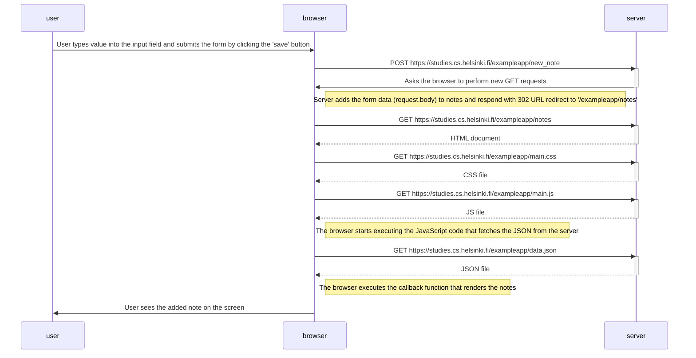

```mermaid
sequenceDiagram
    participant user
    participant browser
    participant server


    user->>browser: User types value into the input field and submits the form by clicking the 'save' button
    browser->>server: POST https://studies.cs.helsinki.fi/exampleapp/new_note
    activate server
    server->>browser: Asks the browser to perform new GET requests
    deactivate server

    Note right of browser: Server adds the form data (request.body) to notes and respond with 302 URL redirect to '/exampleapp/notes'

    browser->>server: GET https://studies.cs.helsinki.fi/exampleapp/notes
    activate server
    server-->>browser: HTML document
    deactivate server

    browser->>server: GET https://studies.cs.helsinki.fi/exampleapp/main.css
    activate server
    server-->>browser: CSS file
    deactivate server

    browser->>server: GET https://studies.cs.helsinki.fi/exampleapp/main.js
    activate server
    server-->>browser: JS file
    deactivate server

    Note right of browser: The browser starts executing the JavaScript code that fetches the JSON from the server

    browser->>server: GET https://studies.cs.helsinki.fi/exampleapp/data.json
    activate server
    server-->>browser: JSON file
    deactivate server

    Note right of browser: The browser executes the callback function that renders the notes

    browser->>user: User sees the added note on the screen
```
