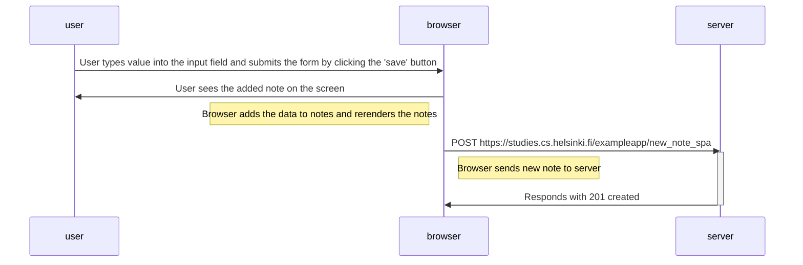

```mermaid
sequenceDiagram
    participant user
    participant browser
    participant server


    user->>browser: User types value into the input field and submits the form by clicking the 'save' button
    browser->>user: User sees the added note on the screen

    Note left of browser: Browser adds the data to notes and rerenders the notes

    browser->>server: POST https://studies.cs.helsinki.fi/exampleapp/new_note_spa
    activate server

    Note right of browser: Browser sends new note to server

    server->>browser: Responds with 201 created
    deactivate server


```
